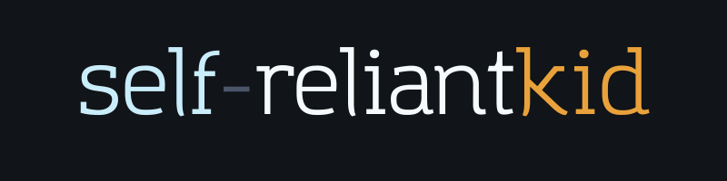

  

---

## Who I am

I'm **Senanu**, a CS student at the **University of Ghana, Legon**.

What I'm actually doing is learning to think like an engineer: breaking problems down, writing code that makes sense, and shipping things I'm not embarrassed to put my name on. I'm the kind of person who gets curious about something and can't stop until I've built it.

I want to be in rooms where I'm learning from people better than me, and contributing something real while I'm at it.I don't have years of experience yet. What I have is the drive to close that gap fast.

---

## What I'm up to

- Going deep on **Python** using real projects, not tutorials
- Exploring **data science** and how data tells stories
- Learning something new every week
- Open to collaborating on meaningful projects

---

## Stack

**Frontend**

**Backend**

**Tools**

---

## Contributions
 
<picture>
  <source media="(prefers-color-scheme: dark)" srcset="https://raw.githubusercontent.com/self-reliantkid/self-reliantkid/output/pacman-contribution-graph-dark.svg">
  <source media="(prefers-color-scheme: light)" srcset="https://raw.githubusercontent.com/self-reliantkid/self-reliantkid/output/pacman-contribution-graph.svg">
  
</picture>
 
---
 
## GitHub Stats

  
  

---

## Let's connect

  
  
  
  

---
